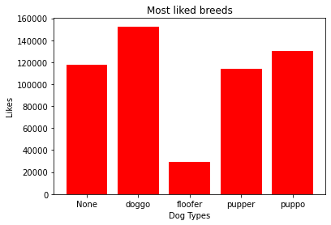

# Act Report

### By Yasmine Hussein
         November 2020

“WeRateDogs is	a Twitter account	that	rates	people's dogs with	a	humorous	comment	about	the	dog.	It	was	
started	in	2015 by	college	student	Matt	Nelson and	has	received	international	media	coverage	both	for	its	
popularity and	for	the	attention	drawn	to social	media copyright	law when	it	was	suspended	by	Twitter.”, from
Wikipedia. As	of	December	2017,	the	Twitter	account	has	nearly	4.56	million	followers.	
The	data,	which	was	made	available	to	me	by	Udacity	as	part	of	my	Data	Analyst	Nanodegree	program only	
included	tweets	up	to	August	1st,	2017	and	were	then	filtered	to	remove	retweets,	tweets	with	dog	breed	
missing	and	tweets	where	there	was	no	image.		

From the WeRateDogs Twitter account we can obtain quickly some initial information to start with:

We can answer the following questions:
- Which breeds are most tweeted about?
- Which breeds obtain the highest ratings? 
- Which breeds receive most likes?


```python
# Import visualization libraries
import pandas as pd
import matplotlib.pyplot as plt
# 'Magic word' so that your visualizations are plotted
%matplotlib inline
# Read the data
df_clean = pd.read_csv('twitter_archive_master.csv')
# Quick analysis of some of the numbers 
df_clean.describe()
```


<div>
<style scoped>
    .dataframe tbody tr th:only-of-type {
        vertical-align: middle;
    }

    .dataframe tbody tr th {
        vertical-align: top;
    }

    .dataframe thead th {
        text-align: right;
    }
</style>
<table border="1" class="dataframe">
  <thead>
    <tr style="text-align: right;">
      <th></th>
      <th>tweet_id</th>
      <th>rating_numerator</th>
      <th>rating_denominator</th>
      <th>favorites</th>
      <th>retweet_count</th>
      <th>img_num</th>
      <th>p1_conf</th>
      <th>p2_conf</th>
      <th>p3_conf</th>
    </tr>
  </thead>
  <tbody>
    <tr>
      <th>count</th>
      <td>1.964000e+03</td>
      <td>1964.000000</td>
      <td>1964.000000</td>
      <td>1964.000000</td>
      <td>1964.000000</td>
      <td>1964.000000</td>
      <td>1964.000000</td>
      <td>1.964000e+03</td>
      <td>1.964000e+03</td>
    </tr>
    <tr>
      <th>mean</th>
      <td>7.358154e+17</td>
      <td>12.223014</td>
      <td>10.479124</td>
      <td>8140.168534</td>
      <td>2400.277495</td>
      <td>1.202138</td>
      <td>0.593928</td>
      <td>1.346393e-01</td>
      <td>6.028936e-02</td>
    </tr>
    <tr>
      <th>std</th>
      <td>6.744191e+16</td>
      <td>41.708155</td>
      <td>6.865424</td>
      <td>11973.685598</td>
      <td>4289.830947</td>
      <td>0.559615</td>
      <td>0.272134</td>
      <td>1.009430e-01</td>
      <td>5.096697e-02</td>
    </tr>
    <tr>
      <th>min</th>
      <td>6.660209e+17</td>
      <td>0.000000</td>
      <td>2.000000</td>
      <td>69.000000</td>
      <td>11.000000</td>
      <td>1.000000</td>
      <td>0.044333</td>
      <td>1.011300e-08</td>
      <td>1.740170e-10</td>
    </tr>
    <tr>
      <th>25%</th>
      <td>6.758399e+17</td>
      <td>10.000000</td>
      <td>10.000000</td>
      <td>1745.750000</td>
      <td>534.750000</td>
      <td>1.000000</td>
      <td>0.362775</td>
      <td>5.352722e-02</td>
      <td>1.619708e-02</td>
    </tr>
    <tr>
      <th>50%</th>
      <td>7.087246e+17</td>
      <td>11.000000</td>
      <td>10.000000</td>
      <td>3673.500000</td>
      <td>1161.000000</td>
      <td>1.000000</td>
      <td>0.587357</td>
      <td>1.173995e-01</td>
      <td>4.947920e-02</td>
    </tr>
    <tr>
      <th>75%</th>
      <td>7.877408e+17</td>
      <td>12.000000</td>
      <td>10.000000</td>
      <td>10159.000000</td>
      <td>2742.000000</td>
      <td>1.000000</td>
      <td>0.847062</td>
      <td>1.955617e-01</td>
      <td>9.162278e-02</td>
    </tr>
    <tr>
      <th>max</th>
      <td>8.924206e+17</td>
      <td>1776.000000</td>
      <td>170.000000</td>
      <td>152489.000000</td>
      <td>75465.000000</td>
      <td>4.000000</td>
      <td>1.000000</td>
      <td>4.880140e-01</td>
      <td>2.734190e-01</td>
    </tr>
  </tbody>
</table>
</div>


```python
# Which breeds are most tweeted
df_clean.dog_type.value_counts()
```


    None       1662
    pupper      209
    doggo        62
    puppo        23
    floofer       8
    Name: dog_type, dtype: int64


#### so pupper is the most tweeted dog breed!


```python
##Which breeds obtain the highest ratings?
df_clean.loc[df_clean.rating_numerator.max()].dog_type
```


    'pupper'


#### so still pupper getting the highest rating!


```python
# Plot a bar chart
plt.bar(df_clean.dog_type, df_clean.favorites, color= 'red')
plt.xlabel("Dog Types")
plt.ylabel("Likes")
plt.title("Most liked breeds")

```


    Text(0.5, 1.0, 'Most liked breeds')





#### from chart we can see the doggo breed type has the most likes!
